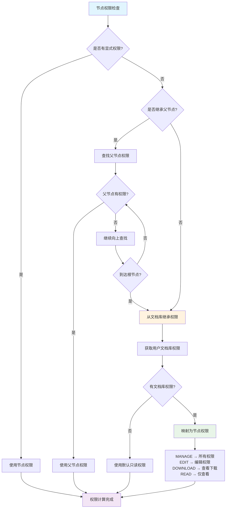

# 文档节点权限控制说明

## 权限继承流程

```mermaid
graph TD
    A["节点权限检查"] --> B{是否有显式权限?}
    B -->|是| C["使用节点权限"]
    B -->|否| D{是否继承父节点?}
    D -->|是| E["查找父节点权限"]
    E --> F{父节点有权限?}
    F -->|是| G["使用父节点权限"]
    F -->|否| H["继续向上查找"]
    H --> I{到达根节点?}
    I -->|否| F
    I -->|是| J["从文档库继承权限"]
    D -->|否| J

    J --> K["获取用户文档库权限"]
    K --> L{有文档库权限?}
    L -->|是| M["映射为节点权限"]
    L -->|否| N["使用默认只读权限"]

    M --> O["MANAGE → 所有权限<br/>EDIT → 编辑权限<br/>DOWNLOAD → 查看下载<br/>READ → 仅查看"]

    C --> P["权限计算完成"]
    G --> P
    N --> P
    O --> P

    style A fill:#e1f5fe
    style J fill:#fff3e0
    style M fill:#e8f5e8
    style P fill:#f3e5f5
```
