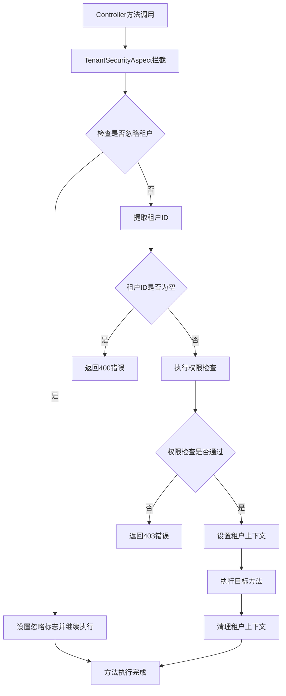

# Bote-Document 模块租户使用指南

## 概述

Bote-Document模块采用基于AOP的租户安全机制，通过`TenantSecurityAspect`切面自动处理租户ID的提取、验证和安全检查。该机制确保所有Controller方法都能正确获取和使用租户上下文信息。

## 核心组件

### 1. TenantSecurityAspect（租户安全切面）

- **位置**: `com.iwhalecloud.bote.doc.common.tenant.TenantSecurityAspect`
- **功能**: 拦截所有Controller方法，自动提取和验证租户ID
- **优先级**: `@Order(1)` - 最高优先级执行

### 2. TenantContextHolder（租户上下文持有者）

- **位置**: `com.iwhalecloud.bote.doc.common.tenant.TenantContextHolder`
- **功能**: 基于ThreadLocal的租户上下文管理
- **特性**: 线程安全，自动清理

### 3. TenantProperties（租户配置）

- **位置**: `com.iwhalecloud.bote.doc.common.tenant.TenantProperties`
- **功能**: 租户相关配置管理
- **配置项**: 启用状态、忽略URL列表等

### 4. TenantSecurityCustomizer（租户安全定制器）

- **位置**: `com.iwhalecloud.bote.doc.common.tenant.TenantSecurityCustomizer`
- **功能**: 自定义租户访问权限检查
- **特性**: 可扩展的权限验证机制

### 5. TenantLineInnerInterceptor（MyBatis租户拦截器）

- **位置**: `com.iwhalecloud.bote.doc.common.mybatis.plugins.inner.TenantLineInnerInterceptor`
- **功能**: 自动为SQL语句添加租户条件，实现数据隔离
- **特性**: 支持INSERT、UPDATE、DELETE、SELECT语句的自动租户条件注入

## 工作机制

### 1. 切面拦截流程



### 2. 租户ID提取优先级

1. **URL参数** - `tenantId`参数
2. **HTTP Header** - `tenantId`请求头
3. **方法参数** - 直接参数名为`tenantId`
4. **TenantBaseRO对象** - 包含`tenantId`字段的请求对象
5. **BaseEntity子类** - 通过反射查找`tenantId`字段或`getTenantId()`方法

### 3. 忽略机制

#### 3.1 配置忽略

```yaml
bote:
  tenant:
    enable: true
    ignore-urls:
      - "/api/public/**"
      - "/health"
      - "/actuator/**"
```

#### 3.2 注解忽略

```java
@RestController
@IgnoreTenant  // 类级别忽略
public class PublicController {

    @GetMapping("/public/info")
    @IgnoreTenant  // 方法级别忽略
    public ResultVO<String> getPublicInfo() {
        return ResultVO.success("public info");
    }
}
```

#### 3.3 内置忽略URL

系统内置以下URL自动忽略租户检查：

- `/**/doc.html` - Swagger文档
- `/error` - 错误页面
- `/favicon.ico` - 网站图标
- `/**/swagger-resources/**` - Swagger资源
- `/**/v2/api-docs` - API文档
- `/**/v3/api-docs` - API文档
- `/**/webjars/**` - Web资源

## 使用方式

### 1. 基础使用

#### 1.1 通过URL参数传递

```http
GET /bote/dc/document/node/detail/doc123?tenantId=1001
```

#### 1.2 通过Header传递

```http
GET /bote/dc/document/node/detail/doc123
Headers:
  tenantId: 1001
```

#### 1.3 通过请求体传递

```java
@PostMapping("/create")
public ResultVO<String> createDocument(@RequestBody DocumentCreateRequest request) {
    // request.getTenantId() 会自动被提取
    return ResultVO.success("创建成功");
}

// DocumentCreateRequest 继承 TenantBaseRO
public class DocumentCreateRequest extends TenantBaseRO {
    private String documentName;
    // tenantId 字段自动继承
}
```

### 2. 在业务代码中获取租户ID

如需特别获取tenantId, 使用 `TenantContextHolder.getTenantId()` 来获取上下文的租户ID

```java
@Service
public class DocumentService {

    public void processDocument() {
        // 获取当前租户ID
        Long tenantId = TenantContextHolder.getTenantId();

        // 检查是否忽略租户
        boolean isIgnore = TenantContextHolder.isIgnore();

        if (tenantId != null) {
            // 基于租户ID的业务逻辑
            processWithTenant(tenantId);
        }
    }
}
```

### 3. 自定义权限检查

```java
@Component
public class CustomTenantSecurityCustomizer implements TenantSecurityCustomizer {

    @Override
    public boolean checkAccess(Long tenantId) {
        // 自定义权限检查逻辑
        // 例如：检查用户是否有权限访问该租户
        return hasPermission(tenantId);
    }
}
```

## 配置说明

### 1. 基础配置

```yaml
bote:
  tenant:
    # 是否启用租户功能
    enable: true
    # 忽略的URL列表
    ignore-urls:
      - "/api/public/**"
      - "/health"
      - "/actuator/**"
```

### 2. MyBatis租户拦截器配置

系统已集成`TenantLineInnerInterceptor`拦截器，会自动为所有SQL语句添加租户条件，实现数据隔离。

**配置要点**：

- 拦截器会自动拦截SELECT、INSERT、UPDATE、DELETE语句
- 自动从`TenantContextHolder`获取当前租户ID
- 自动为SQL添加`tenant_id = ?`条件
- 支持忽略特定表和方法

### 3. 常量配置

```java
// 租户ID参数名
public static final String PARAM_TENANT_ID = "tenantId";

// 租户ID请求头名
public static final String TENANT_HEADER = "tenantId";
```

## 最佳实践

### 1. 请求对象设计

```java
// 推荐：继承TenantBaseRO
public class DocumentCreateRequest extends TenantBaseRO {
    private String documentName;
    private String content;
    // tenantId 自动继承
}

// 或者：实现BaseEntity
public class DocumentEntity extends BaseEntity {
    private String documentName;
    private String content;
    // 子类需包含tenantId字段
    private Long tenantId;
}
```

### 2. 数据库表设计

所有需要租户隔离的表都必须包含`tenant_id`字段，拦截器会自动为这些表添加租户条件。

### 3. MyBatis拦截器机制

`TenantLineInnerInterceptor`会自动拦截所有SQL语句并添加租户条件：

- **INSERT语句**: 自动添加`tenant_id`字段和值
- **SELECT语句**: 自动添加`WHERE tenant_id = ?`条件
- **UPDATE语句**: 自动添加`AND tenant_id = ?`条件
- **DELETE语句**: 自动添加`AND tenant_id = ?`条件

### 4. 忽略机制

- **忽略特定方法**: 使用`@InterceptorIgnore(tenantLine = true)`注解
- **忽略特定表**: 在`TenantLineHandler.ignoreTable()`中配置
- **忽略特定包**: 通过`InterceptorIgnoreHelper`配置包路径匹配

## 常见问题

### 1. 租户ID提取失败

**问题**: 返回"未传递租户ID"错误
**解决方案**:

- 检查请求是否包含`tenantId`参数或Header
- 确认请求对象是否正确继承`TenantBaseRO`
- 验证`TenantProperties.enable`是否为true

### 2. 权限检查失败

**问题**: 返回"无权访问此租户"错误
**解决方案**:

- 检查`TenantSecurityCustomizer`实现
- 验证用户是否有访问该租户的权限
- 确认租户ID是否有效

### 3. 忽略机制不生效

**问题**: 应该忽略的URL仍然进行租户检查
**解决方案**:

- 检查URL模式是否正确匹配
- 确认`@IgnoreTenant`注解位置正确
- 验证配置的忽略URL列表

### 4. 租户上下文丢失

**问题**: 在异步方法中无法获取租户ID
**解决方案**:

- 在异步执行前保存租户上下文
- 在异步方法开始时恢复租户上下文
- 考虑使用`@Async`的线程池配置

### 5. MyBatis拦截器不生效

**问题**: SQL语句没有自动添加租户条件
**解决方案**:

- 检查`TenantLineInnerInterceptor`是否正确配置
- 确认`TenantLineHandler` Bean是否正确注册
- 验证数据库表是否包含`tenant_id`字段
- 检查是否使用了`@InterceptorIgnore(tenantLine = true)`注解

### 6. 系统表被误拦截

**问题**: 系统表也被添加了租户条件
**解决方案**:

- 配置文件中新增bote.dc.tenant.ignore-tables配置，需要注意，此配置为数组，需包含全量的配置
- 使用`@InterceptorIgnore(tenantLine = true)`注解忽略特定方法
